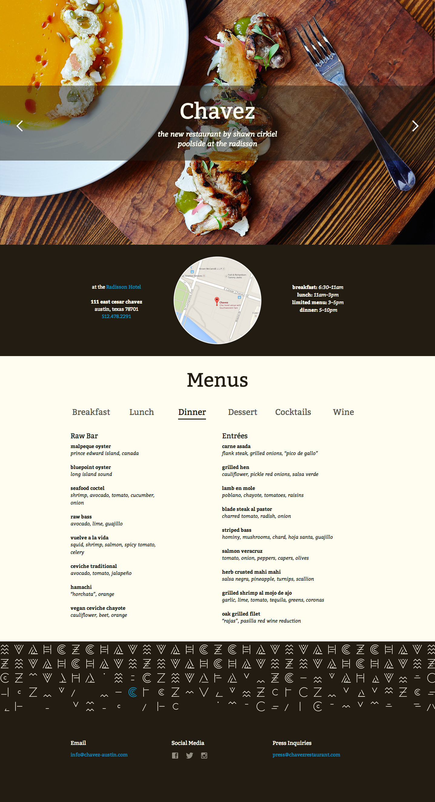

# Restaurant Project

## Assignment

Your assignment is to recreate this restaurant site. 

## Fork Git Repo

Fork this git repo on GitHub. Then clone it into your MakerSquare/ projects folder—**NOT** your github.io folder, just MakerSquare/; remember, we don't want git repos inside git repos.

You can do this via command line or via the GitHub app.

### Command Line

`cd` into your MakerSquare projects folder.
run `git clone [link to repo]`
`cd mks-restaurant-project`

### GitHub

Go to the Repositories view.
Click on your username in the sidebar.
Find the `mks-restaurant-project` repo in the list.
Click 'clone to computer' and install it into the MakerSquare projects folder.

## Assignment Detail

Everywhere there is something you need to do, there is a TODO comment for you to find and write code there. Use them to guide you as you go through these steps in order:

1. Install Foundation! http://foundation.zurb.com/develop/download.html Download all their CSS and JS and put it in the appropriate /css and /js folders.

2. Link to the foundation `normalize.css` and `foundation.min.css` in your `index.html`. You should see the typography change once they are linked; verify they are working with dev inspector.

3. Write HTML for the layout. We're using Foundation so we can use their grid system. Use rows and columns; make it responsive! Remember that when you use the `small` grid classes, they apply up to large sizes too.

4. Style the sections with typography, colors, links, etc.

Add the Google Font "Bitter" in your `index.html` and then in your CSS.

In `application.css`, write CSS to give the different page sections the appropriate background colors, fonts, etc. Be sure you have done the HTML first!

5. Make the slideshow work.

Download and install Slides.js into your JS folder: http://www.slidesjs.com/

In your `index.html`, jQuery is already linked, and now we need to link to the slides.js file with a script tag.

Now look at the Slides.js site to see how to use it: http://slidesjs.com/ You'll write some jQuery to make the Slides plugin work. You can write it in `index.html` after your link to `slides.min.jquery.js`.

We want it to:
* play automatically with the effect fade and an interval of 7000
* have pagination: false (not show the pagination numbers)
* have the navigation use the fade effect

The CSS for the slideshow is already linked in `index.html` for you; just make the JS work.

Next class, more details TBD:

6. Add the menu items via a JSON feed.
7. Write JS to make the menu sections show/hide on click.
